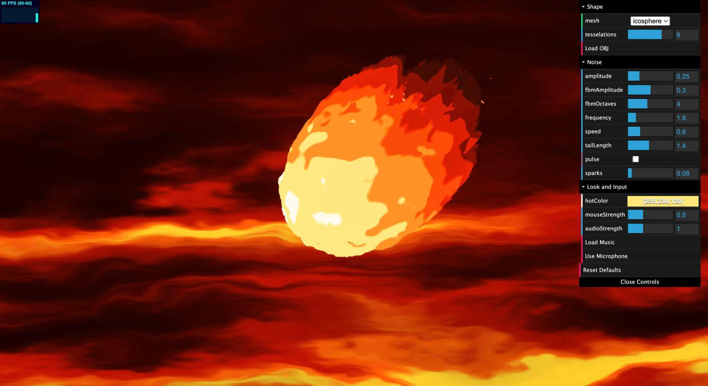

# HW 1: WebGL Fireball

Ximing Luo, CIS 5660 Fall 2026

Live demo: https://ximluo.github.io/hw01-fireball/

<p align="center">
  
</p>

## What it is

A stylized fireball made from the base icosphere. The vertex shader pushes the mesh around with noise and pulls it into a teardrop with a trailing tail, the fragment shader colors it based on how far each vertex moved, and everything is driven by a time uniform. The look is stylized cel shaded, flat bands of color.

## How the vertex shader works

There are two layers of displacement along the normal. The first is a low frequency, high amplitude wobble made from a product of three sine waves over position and time. On its own that just makes a lumpy blob, but it keeps the overall shape moving. The second layer is fbm over 3D Perlin noise at a higher frequency and lower amplitude. On the tail side the noise is run through a ridged version (one minus the absolute value), which turns round bumps into sharp flame shapes.

The tail comes from two steps. Vertices on the back half get pulled in toward the tail axis, with the pull growing quadratically the further back they sit, so the sphere becomes a teardrop. Then vertices facing the tail direction get stretched along it, scaled by the squared ridged noise, so only some parts of the tail shoot out far and the trailing edge ends up jagged instead of smooth.

There is also a pulse mode that feeds a sawtooth on time into an impulse function, so the whole ball swells and settles every few seconds.

## How the fragment shader works

The vertex shader passes down the normal displacement and the tail stretch as two floats. The fragment shader combines them into one heat value: more displacement means hotter, more tail means cooler, so the head stays white and the trailing flames fade toward black. Heat is then mapped through a ramp that goes near black, maroon, red, orange, the hot color from the GUI, and white. Every color section is just the hot color times a fixed multiplier, so picking a blue hot color turns the whole scene blue, background and sparks included. The heat gets quantized into six bands, with some scrolling 3D noise added first so the band edges stay ragged rather than forming clean rings.

Toolbox functions used across the shaders: bias, gain, smoothstep, sawtooth, impulse, triangle wave, parabola, and ease in quadratic.

## Controls

The dat.GUI panel has a Shape folder (mesh dropdown, tesselations, Load OBJ), a Noise folder (amplitude, fbmAmplitude, fbmOctaves, frequency, speed, tailLength, pulse, sparks), and a Look and Input folder (hotColor, mouseStrength, audioStrength, Load Music, Use Microphone). Reset Defaults puts everything back. Dragging on the canvas orbits the camera.

## Extra

The background is a full screen quad with its own shader. It stretches domain warped fbm horizontally so the noise reads as streaks sweeping past, layers a sine ripple on top, fades darker toward the top of the screen so the bottom glows, and adds a soft radial glow behind the ball.

The custom mesh option is a small OBJ loader that reads positions, normals, and faces, fan triangulates polygons, computes smooth normals when the file has none, and centers and scales the model to fit. A subdivided five point star is provided as an example, and the Load OBJ button takes any other model.

For mouse interaction, the cursor position is unprojected through the inverse view projection matrix into a ray, intersected with the plane through the origin that faces the camera, and sent to the vertex shader, which dents the surface near that point. The position and strength are smoothed over frames so the dent eases in, trails the cursor a bit, and fades out when the cursor leaves the canvas.

For music, Load Music plays an audio file through a Web Audio analyser node and Use Microphone does the same with mic input. The average energy in the lowest frequency bins is smoothed and passed to the shaders, where it swells the displacement, lengthens the tail, and brightens the background glow.

## Sparks

On top of the four options there is a particle pass for embers. It draws 1500 point sprites, and each particle only stores four random seeds. The vertex shader turns the seeds plus time into a spawn point along the tail, a velocity, a lifetime, and a wobble, so nothing runs on the CPU per frame. About a quarter of the particles are sparks: fast, short lived, drawn as thin flat streaks rotated to line up with their own screen space motion. The rest are embers: slow tumbling blocks with a lighter core that shrinks as they cool, colors stepping from orange to red to dark red, and a blink near the end. Everything is flat color so it matches the ball.

## Running it

```
npm install
npm run dev
```

Then open http://localhost:5660. The music and mic features need a click on their buttons first because browsers block audio until there has been some user input.